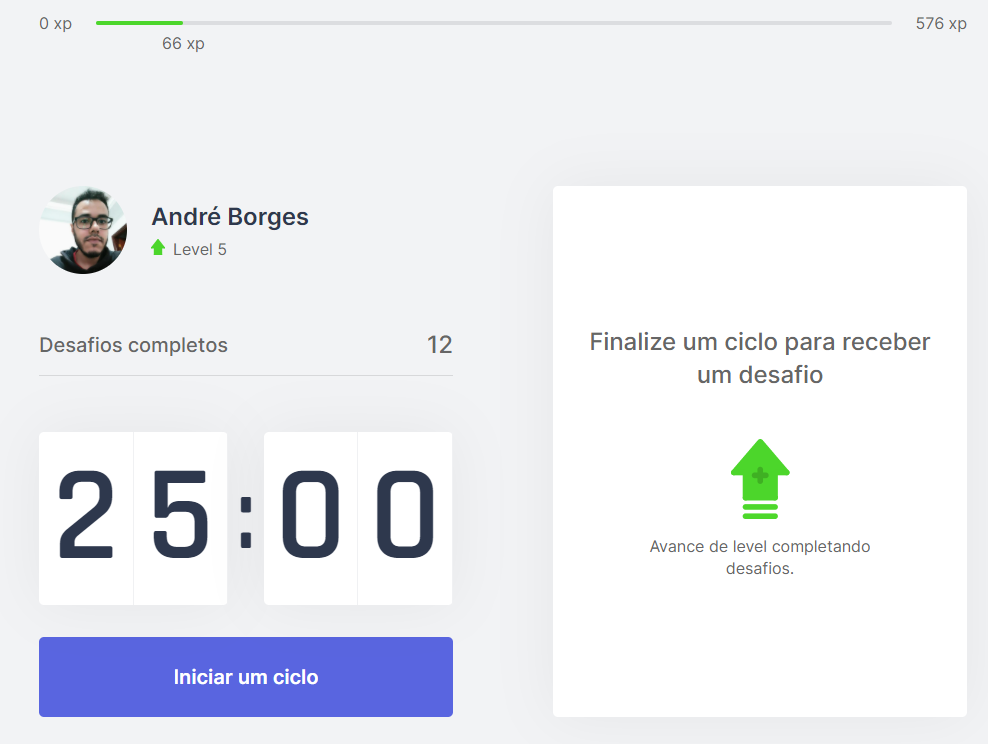

<h1 align="center">
  
</h1>

<p align="center">
  
<p>

## 💻 Sobre

Projeto feito durante a <strong>Next Level Week #4</strong> da <a href="http://app.rocketseat.com.br">Rocketseat</a>. O intuito do evento era para realizar o desenvolvimento de uma aplicação voltada para todos que ficam diretamente na frente do computador (principalmente desenvolvedores) através do uso de tecnologias que estão em alta no mercado (ReactJS - Foco em utilização do NextJS).

A ideia é de que o usuário utiliza de um timer para que a cada 25 minutos ela seja lembrada de fazer uma pausa e, durante a pausa, realizar um exercício específico que a aplicação desponibiliza. Após a realização do exercício o usuário confirma que realizou o exercício e recebe uma motivação (no caso foi utilizado a temática de RPGs, como ganhar experiência para subir de level.) e segue para o próximo timer.

<br/>

## 🎨 Layout

<p>
  Você pode ver o layout original do projeto através deste <a href="https://www.figma.com/file/ge20pu3ofMOKoliUyKx1Nl/Move.it-1.0/" alt="Link para o layout">link</a>. É necessário uma conta no <a href="https://figma.com/" alt="Homepage do Figma">Figma</a> para acessá-lo.
</p>

<br/>

## 🚀 Tecnologias

This is a [Next.js](https://nextjs.org/) project bootstrapped with [`create-next-app`](https://github.com/vercel/next.js/tree/canary/packages/create-next-app).

O projeto foi desenvolvido com as seguintes tecnologias:

- **[ReactJS](https://developer.mozilla.org/en-US/docs/Glossary/HTML)**
- **[NextJS](https://sass-lang.com/documentation/syntax)**

<br/>

## Getting Started

First, run the development server:

```bash
npm run dev
# or
yarn dev
```

Open [http://localhost:3000](http://localhost:3000) with your browser to see the result.

<br/>

## Learn More

To learn more about Next.js, take a look at the following resources:

- [Next.js Documentation](https://nextjs.org/docs) - learn about Next.js features and API.
- [Learn Next.js](https://nextjs.org/learn) - an interactive Next.js tutorial.

You can check out [the Next.js GitHub repository](https://github.com/vercel/next.js/) - your feedback and contributions are welcome!

<br/>

## Deploy on Vercel

The easiest way to deploy your Next.js app is to use the [Vercel Platform](https://vercel.com/new?utm_medium=default-template&filter=next.js&utm_source=create-next-app&utm_campaign=create-next-app-readme) from the creators of Next.js.

Check out our [Next.js deployment documentation](https://nextjs.org/docs/deployment) for more details.

<br/>

- https://moveit-gold-alpha.vercel.app/
